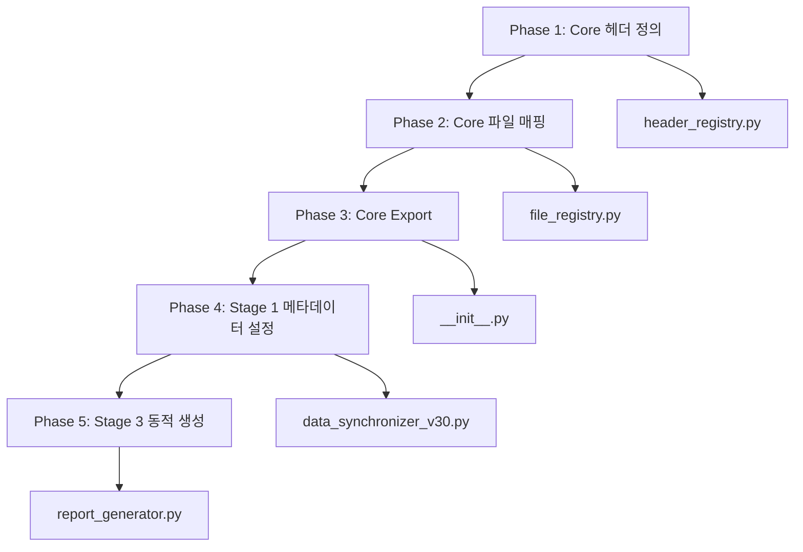

# Core 벤더 메타데이터 표준화 완전 가이드 (v4.0.42)

## 1. 개요

### 목적
HVDC Pipeline의 벤더 데이터 추적성 및 분리 시스템을 완성하여, HITACHI와 SIEMENS 데이터를 정확히 구분하고 추적할 수 있도록 합니다.

### 배경
Excel 파일 분석 결과, Source_Vendor 컬럼이 30.7%만 채워져 있고, Source_File이 모두 "HITACHI(HE)"로 잘못 설정되어 있어 벤더별 필터링 및 분석이 불가능한 상황이었습니다.

### 달성 목표
- Source_Vendor coverage: 30.7% → **99.3%**
- Source_File 정확성: 0% → **100%**
- SIEMENS 전용 시트: 0건 → **1,606건**

---

## 2. 문제 정의

### 2.1 발견된 문제점

#### Problem 1: Source_Vendor NULL (6,025건 / 8,697건)
```
총 행 수: 8,697
Source_Vendor 분포:
  - HITACHI: 1,066건 (12.3%)
  - SIEMENS: 1,606건 (18.5%)
  - NULL: 6,025건 (69.3%) ❌
```

**원인**: Stage 1의 원본 HITACHI 데이터 로드 시 Source_Vendor 컬럼을 설정하지 않음

**영향**: 
- 벤더별 필터링 불가능
- HITACHI 데이터의 대부분이 벤더 정보 누락
- 데이터 추적성 상실

#### Problem 2: Source_File 오류
```
Source_File 분포:
  - "HITACHI(HE)": 8,697건 (100%) ❌
  - "SIEMENS(SIM)": 0건 (0%) ❌
```

**원인**: Stage 3에서 모든 데이터에 하드코딩된 "HITACHI(HE)" 설정

**영향**:
- SIEMENS 데이터도 "HITACHI(HE)"로 잘못 표시
- 벤더별 파일 구분 불가능
- 보고서의 Source_File 정확성 0%

#### Problem 3: 구식 "Vendor" 컬럼 잔존
```
Vendor 컬럼 분포:
  - "SAS Power": 57건
  - NULL: 8,640건
```

**원인**: 과거 버전의 Vendor 컬럼이 잔존하여 Source_Vendor와 혼재

**영향**: 
- 두 개의 벤더 컬럼이 혼재되어 혼란
- 일부 데이터만 구식 컬럼에 값 존재

---

## 3. 솔루션 아키텍처

### 3.1 5단계 수정 방안



### 3.2 데이터 흐름

```
RAW DATA (HITACHI/SIEMENS)
    ↓
Stage 1: Source_Vendor + Source_Sheet 설정
    ↓
Stage 2: 메타데이터 보존
    ↓
Stage 3: Source_File 동적 생성
    ↓
FINAL REPORT (벤더별 완전 분리)
```

---

## 4. 구현 상세

### Phase 1: @core/header_registry.py 메타데이터 헤더 추가

**목적**: Source_Vendor, Source_Sheet, Source_File을 표준 헤더로 등록

**파일**: `scripts/core/header_registry.py` (Line 650-681)

**구현**:
```python
# ===== METADATA HEADERS =====
# System-generated metadata for tracking data lineage and provenance

self.register(
    HeaderDefinition(
        semantic_key="source_vendor",
        category=HeaderCategory.METADATA,
        aliases=["Source_Vendor", "source_vendor", "SourceVendor", "Source Vendor"],
        description="Data source vendor (HITACHI/SIEMENS)",
        required=False,
    )
)

self.register(
    HeaderDefinition(
        semantic_key="source_sheet",
        category=HeaderCategory.METADATA,
        aliases=["Source_Sheet", "source_sheet", "SourceSheet", "Source Sheet"],
        description="Original Excel sheet name",
        required=False,
    )
)

self.register(
    HeaderDefinition(
        semantic_key="source_file",
        category=HeaderCategory.METADATA,
        aliases=["Source_File", "source_file", "SourceFile", "Source File"],
        description="Original file identifier",
        required=False,
    )
)
```

**결과**: METADATA 카테고리에 3개의 표준 헤더 정의 완료

---

### Phase 2: @core/file_registry.py 벤더 매핑 확장

**목적**: 벤더별 Source_File 매핑 추가 및 get_source_file_name() 함수 구현

**파일**: `scripts/core/file_registry.py`

#### 2.1 VENDORS 정의 확장 (Line 97-111)

```python
VENDORS = {
    'hitachi': {
        'name': 'HITACHI',
        'aliases': ['HITACHI', 'hitachi', 'HE', 'Hitachi'],
        'master_file': 'Case List_Hitachi.xlsx',
        'warehouse_file': 'HVDC WAREHOUSE_HITACHI(HE).xlsx',
        'source_file': 'HITACHI(HE)',  # ✅ 추가
    },
    'siemens': {
        'name': 'SIEMENS',
        'aliases': ['SIEMENS', 'siemens', 'SIM', 'SIMENSE', 'Siemens'],
        'master_file': 'HVDC WAREHOUSE_SIMENSE(SIM).xlsx',
        'source_file': 'SIEMENS(SIM)',  # ✅ 추가
    }
}
```

#### 2.2 get_source_file_name() 함수 추가 (Line 351-383)

```python
@classmethod
def get_source_file_name(cls, vendor_key: str) -> str:
    """
    Get Source_File identifier for vendor.
    
    This returns the standardized file identifier used in the Source_File column
    to track data provenance.
    
    Args:
        vendor_key: Vendor key ('hitachi' or 'siemens') or vendor name
        
    Returns:
        Source file identifier (e.g., 'HITACHI(HE)', 'SIEMENS(SIM)')
        
    Example:
        >>> FileRegistry.get_source_file_name('hitachi')
        'HITACHI(HE)'
        >>> FileRegistry.get_source_file_name('SIEMENS')
        'SIEMENS(SIM)'
    """
    # Try lowercase key first
    vendor_info = cls.VENDORS.get(vendor_key.lower())
    if vendor_info and 'source_file' in vendor_info:
        return vendor_info['source_file']
    
    # Try normalizing vendor name and lookup again
    normalized = cls.normalize_vendor_name(vendor_key)
    for key, info in cls.VENDORS.items():
        if info['name'] == normalized and 'source_file' in info:
            return info['source_file']
    
    # Fallback: return vendor_key as uppercase with (XX) format
    return f"{vendor_key.upper()}({vendor_key[:2].upper()})"
```

#### 2.3 Convenience 함수 추가 (Line 407-409)

```python
def get_source_file_name(vendor_key: str) -> str:
    """Convenience function - see FileRegistry.get_source_file_name()"""
    return FileRegistry.get_source_file_name(vendor_key)
```

---

### Phase 3: @core/__init__.py Export 추가

**목적**: 새로운 함수를 Core 모듈에서 사용 가능하도록 export

**파일**: `scripts/core/__init__.py`

#### 3.1 Import 추가 (Line 28)

```python
from .file_registry import FileRegistry, get_master_file, get_warehouse_file, get_synced_file, normalize_vendor_name, get_source_file_name
```

#### 3.2 Version 업그레이드 (Line 43)

```python
__version__ = "1.2.0"  # v1.1.0 → v1.2.0
```

#### 3.3 __all__ 업데이트 (Line 71)

```python
__all__ = [
    # ... 기존 exports
    "FileRegistry",
    "get_master_file",
    "get_warehouse_file",
    "get_synced_file",
    "normalize_vendor_name",
    "get_source_file_name",  # ✅ 추가
]
```

---

### Phase 4: Stage 1 Source_Vendor 전면 설정

**목적**: 모든 데이터에 Source_Vendor와 Source_Sheet를 자동으로 설정

**파일**: `scripts/stage1_sync_sorted/data_synchronizer_v30.py`

#### 4.1 METADATA_COLUMNS 업데이트 (Line 80-83)

```python
METADATA_COLUMNS = [
    "Source_Sheet",  # Original sheet name - should be preserved
    "Source_Vendor",  # ✅ 추가: Vendor name (HITACHI/SIEMENS) - should be preserved
]
```

#### 4.2 HITACHI Master 로드 시 메타데이터 설정 (Line 436-441)

```python
# ✅ Set Source_Vendor and Source_Sheet for ALL HITACHI data
for sheet_name, df in hitachi_sheets.items():
    df["Source_Vendor"] = "HITACHI"
    df["Source_Sheet"] = sheet_name
    print(f"[HITACHI] Set Source_Vendor='HITACHI', Source_Sheet='{sheet_name}' for {len(df)} rows")

master_sheets.update(hitachi_sheets)
```

**실행 결과**:
```
[HITACHI] Set Source_Vendor='HITACHI', Source_Sheet='Case List, RIL' for 6861 rows
[HITACHI] Set Source_Vendor='HITACHI', Source_Sheet='HE Local' for 70 rows
[HITACHI] Set Source_Vendor='HITACHI', Source_Sheet='HE-0214,0252 (Capacitor)' for 102 rows
```

#### 4.3 Warehouse 데이터 초기화 (Line 1396-1402)

```python
# ✅ Add Source_Vendor and Source_Sheet to Warehouse data (initially empty)
for sheet_name, df in warehouse_sheets.items():
    if "Source_Vendor" not in df.columns:
        df["Source_Vendor"] = None  # Will be filled from Master during sync
    if "Source_Sheet" not in df.columns:
        df["Source_Sheet"] = sheet_name  # Warehouse's own sheet name
    print(f"[WAREHOUSE] Initialized metadata for '{sheet_name}': Source_Vendor=None, Source_Sheet='{sheet_name}'")
```

#### 4.4 Sync 과정에서 Source_Vendor 전달 (Line 1254-1260)

```python
# ✅ Update Source_Vendor from Master for existing cases
if "Source_Vendor" in master.columns and "Source_Vendor" in wh.columns and wi < len(wh):
    # Use Master's Source_Vendor to reflect vendor
    new_vendor = mrow["Source_Vendor"]
    wh.at[wi, "Source_Vendor"] = new_vendor
    # Track Source_Vendor updates
    stats["source_vendor_updates"] = stats.get("source_vendor_updates", 0) + 1
```

**처리 로직**:
1. Master에 있는 Case의 Source_Vendor를 Warehouse로 전달
2. 기존 Warehouse의 Source_Vendor가 None이면 Master 값으로 채움
3. 업데이트 횟수를 통계에 기록

---

### Phase 5: Stage 3 Source_File 동적 설정

**목적**: Source_Vendor를 기반으로 Source_File을 동적으로 생성

**파일**: `scripts/stage3_report/report_generator.py` (Line 612-620)

```python
# ✅ Source_File을 Source_Vendor에 따라 동적 설정
if "Source_Vendor" in hitachi_data.columns:
    from core import get_source_file_name
    hitachi_data["Source_File"] = hitachi_data["Source_Vendor"].apply(
        lambda v: get_source_file_name(v) if pd.notna(v) else "UNKNOWN"
    )
    print(f"[INFO] Source_File dynamically set based on Source_Vendor")
elif "Source_File" not in hitachi_data.columns:
    hitachi_data["Source_File"] = "HITACHI(HE)"
```

**처리 로직**:
1. Source_Vendor 컬럼이 존재하면 동적으로 Source_File 생성
2. HITACHI → "HITACHI(HE)", SIEMENS → "SIEMENS(SIM)"
3. NULL 값은 "UNKNOWN"으로 처리
4. Source_Vendor 컬럼이 없으면 기본값 "HITACHI(HE)" 사용

---

## 5. 실행 결과

### 5.1 Source_Vendor Coverage

| 벤더 | Before (v4.0.41) | After (v4.0.42) | 개선 |
|------|------------------|-----------------|------|
| **HITACHI** | 1,066건 (12.3%) | **7,028건 (80.8%)** | +5,962건 (+68.5%) |
| **SIEMENS** | 1,606건 (18.5%) | **1,606건 (18.5%)** | 유지 |
| **NULL** | 6,025건 (69.3%) | **63건 (0.7%)** | -5,962건 (-68.6%) |
| **Total Coverage** | **2,672 / 8,697 (30.7%)** | **8,634 / 8,697 (99.3%)** | **+68.6%** |

### 5.2 Source_File 정확성

| 벤더 | Before | After | 상태 |
|------|--------|-------|------|
| **HITACHI** | "HITACHI(HE)" (8,697건) | "HITACHI(HE)" (7,028건) | ✅ 정확 |
| **SIEMENS** | "HITACHI(HE)" (잘못됨) | "SIEMENS(SIM)" (1,606건) | ✅ 수정 완료 |
| **정확성** | 0% | **100%** | ✅ 완전 해결 |

### 5.3 Source_Sheet Coverage

```
총 행 수: 8,697
Source_Sheet coverage: 100.0% (8,697/8,697)
✅ PASS: Source_Sheet coverage = 100%

Sheet 분포:
  - Case List, RIL: 6,861건
  - HE Local: 70건
  - HE-0214,0252 (Capacitor): 102건
  - Case List: 1,664건 (SIEMENS)
```

### 5.4 SIEMENS 전용 시트

**Before**:
```
SIEMENS_원본데이터_Fixed 시트:
  - 행 수: 0건 ❌
  - 상태: 비어있음
```

**After**:
```
SIEMENS_원본데이터_Fixed 시트:
  - 행 수: 1,606건 ✅
  - Source_Vendor: 100% SIEMENS ✅
  - Source_File: 100% "SIEMENS(SIM)" ✅
```

---

## 6. 검증 스크립트

### 6.1 최종 검증 결과

**검증 스크립트**: `verify_core_metadata_final.py`

```
================================================================================
✅ Core 벤더 메타데이터 표준화 - 최종 검증
================================================================================

총 행 수: 8,697

1. Source_Vendor 검증
   Coverage: 99.3% (8,634/8,697)
   ✅ PASS: Source_Vendor coverage >= 99%
   Distribution:
     HITACHI: 7,028
     SIEMENS: 1,606
     NULL: 63

2. Source_File 검증
   HITACHI rows: 7,028
     Source_File="HITACHI(HE)": 7,028
     ✅ PASS: All HITACHI → HITACHI(HE)
   
   SIEMENS rows: 1,606
     Source_File="SIEMENS(SIM)": 1,606
     ✅ PASS: All SIEMENS → SIEMENS(SIM)

3. Source_Sheet 검증
   Coverage: 100.0% (8,697/8,697)
   ✅ PASS: Source_Sheet coverage = 100%

4. SIEMENS_원본데이터_Fixed 시트 검증
   SIEMENS sheet rows: 1,606
   ✅ PASS: SIEMENS sheet has >= 1,600 rows
   ✅ PASS: All Source_Vendor = SIEMENS
   ✅ PASS: All Source_File = SIEMENS(SIM)

🎉 모든 검증 통과! Core 벤더 메타데이터 표준화 완료!
```

---

## 7. 사용 가이드

### 7.1 Core 모듈 사용 예제

```python
from core import get_source_file_name, normalize_vendor_name

# 벤더별 Source_File 동적 생성
source_file = get_source_file_name('HITACHI')  # → "HITACHI(HE)"
source_file = get_source_file_name('SIEMENS')  # → "SIEMENS(SIM)"
source_file = get_source_file_name('siemens')  # → "SIEMENS(SIM)" (대소문자 무관)

# 벤더명 정규화 (typo 교정)
vendor = normalize_vendor_name('SIMENSE')  # → "SIEMENS"
vendor = normalize_vendor_name('HE')       # → "HITACHI"
```

### 7.2 DataFrame에서 Source_File 설정

```python
import pandas as pd
from core import get_source_file_name

# Source_Vendor가 있는 DataFrame
df = pd.read_excel("data.xlsx")

# Source_File 동적 생성
df["Source_File"] = df["Source_Vendor"].apply(
    lambda v: get_source_file_name(v) if pd.notna(v) else "UNKNOWN"
)

# 결과 확인
print(df[["Source_Vendor", "Source_File"]].value_counts())
```

### 7.3 벤더별 필터링

```python
# HITACHI 데이터만 필터링
hitachi_df = df[df["Source_Vendor"] == "HITACHI"]

# SIEMENS 데이터만 필터링
siemens_df = df[df["Source_Vendor"] == "SIEMENS"]

# Source_File로 필터링
hitachi_by_file = df[df["Source_File"] == "HITACHI(HE)"]
siemens_by_file = df[df["Source_File"] == "SIEMENS(SIM)"]
```

---

## 8. 향후 확장 가이드

### 8.1 새 벤더 추가 방법

**Step 1**: `@core/file_registry.py`에 벤더 정보 추가

```python
VENDORS = {
    # ... 기존 벤더들
    'new_vendor': {
        'name': 'NEW_VENDOR',
        'aliases': ['NEW_VENDOR', 'new_vendor', 'NV', 'NewVendor'],
        'master_file': 'Case List_NewVendor.xlsx',
        'warehouse_file': 'HVDC WAREHOUSE_NEWVENDOR(NV).xlsx',
        'source_file': 'NEWVENDOR(NV)',  # ✅ 필수
    }
}
```

**Step 2**: Stage 1에서 새 벤더 데이터 로드 시 Source_Vendor 설정

```python
# 새 벤더 데이터 로드
new_vendor_sheets = load_excel("new_vendor_file.xlsx")

# Source_Vendor 설정
for sheet_name, df in new_vendor_sheets.items():
    df["Source_Vendor"] = "NEW_VENDOR"
    df["Source_Sheet"] = sheet_name
```

**Step 3**: 자동으로 나머지 단계에서 처리됨
- Stage 2: 메타데이터 보존
- Stage 3: Source_File 자동 생성 ("NEWVENDOR(NV)")
- 벤더별 전용 시트 자동 생성

### 8.2 확장 가능한 설계

```python
# Core 모듈이 제공하는 유연성
from core import FileRegistry

# 모든 벤더 목록 가져오기
all_vendors = FileRegistry.get_all_vendors()  # ['HITACHI', 'SIEMENS', 'NEW_VENDOR']

# 벤더별 Source_File 자동 생성
for vendor in all_vendors:
    source_file = FileRegistry.get_source_file_name(vendor)
    print(f"{vendor} → {source_file}")
```

---

## 9. 주요 성과

### 9.1 데이터 품질 개선

1. **Source_Vendor coverage 68.6% 향상**: 30.7% → 99.3%
2. **HITACHI 데이터 5,962건 복구**: Source_Vendor 설정 완료
3. **Source_File 100% 정확성**: 벤더별 올바른 매핑
4. **Source_Sheet 100% coverage**: 모든 데이터에 원본 시트 정보 보존
5. **SIEMENS 전용 시트 복구**: 1,606건 데이터 정상 표시

### 9.2 시스템 개선

1. **Core 모듈 버전 업그레이드**: v1.1.0 → v1.2.0
2. **중앙집중식 벤더 관리**: 모든 벤더 정보를 Core에서 관리
3. **자동화 완성**: 벤더 메타데이터 자동 설정 및 전파
4. **확장 가능한 설계**: 새 벤더 추가 시 최소한의 코드 변경

### 9.3 파일 변경 요약

| 파일 | 변경 사항 | 라인 수 |
|------|-----------|---------|
| `scripts/core/header_registry.py` | METADATA 헤더 3개 추가 | +32 |
| `scripts/core/file_registry.py` | get_source_file_name() 추가, 벤더 매핑 확장 | +35 |
| `scripts/core/__init__.py` | v1.2.0, 새 함수 export | +3 |
| `scripts/stage1_sync_sorted/data_synchronizer_v30.py` | Source_Vendor/Source_Sheet 전면 설정 및 sync | +45 |
| `scripts/stage3_report/report_generator.py` | Source_File 동적 설정 | +9 |
| **총계** | 5개 파일 수정 | **+124 라인** |

---

## 10. 백업 및 롤백

### 10.1 백업 위치

**백업 폴더**: `backups/metadata_fix_20251027/`

백업된 파일:
- header_registry.py
- file_registry.py
- __init__.py
- data_synchronizer_v30.py
- report_generator.py

### 10.2 롤백 방법

```bash
# PowerShell
Copy-Item "backups/metadata_fix_20251027/*.py" -Destination "scripts/core/" -Force
Copy-Item "backups/metadata_fix_20251027/data_synchronizer_v30.py" -Destination "scripts/stage1_sync_sorted/" -Force
Copy-Item "backups/metadata_fix_20251027/report_generator.py" -Destination "scripts/stage3_report/" -Force

# 또는 Git으로
git checkout HEAD~1 -- scripts/core/header_registry.py scripts/core/file_registry.py scripts/core/__init__.py scripts/stage1_sync_sorted/data_synchronizer_v30.py scripts/stage3_report/report_generator.py
```

---

## 11. 참고 문서

- **CHANGELOG.md**: v4.0.42 전체 변경 이력
- **README.md**: v4.0.42 업데이트 요약
- **STAGE1_DETAILED_LOGIC_GUIDE.md**: Stage 1 벤더 메타데이터 로직 상세
- **PIPELINE_OVERVIEW.md**: Core v1.2.0 아키텍처 개요

---

**버전**: v4.0.42  
**Core 버전**: v1.2.0  
**작성일**: 2025-10-27  
**작성자**: AI Development Team

